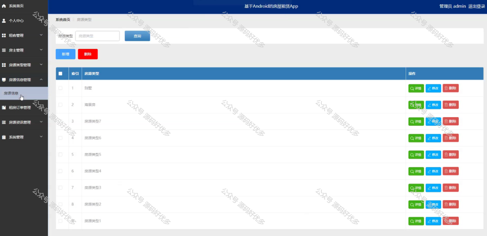

 
## 查看主页获取源码

> **作者介绍**： **✌**全网粉丝10W+本平台特邀作者、博客专家、CSDN新星计划导师、java领域优质创作者,博客之星、掘金/华为云/阿里云/InfoQ等平台优质作者、专注于项目实战 **✌**

  

### 一、作品包含

源码+数据库+设计文档万字+PPT+全套环境和工具资源+部署教程

### 二、项目技术

前端技术：Html、Css、Js、Vue、Element-ui

数据库：MySQL

后端技术：Java、Spring Boot、MyBatis

  

### 三、运行环境

开发工具：IDEA/eclipse + 微信开发者工具

数据库：MySQL5.7

数据库管理工具：Navicat10以上版本

环境配置软件： JDK1.8+Maven3.6.3

前端Nodejs：14

### 四、项目介绍
项目编号：mpweixinA037

随着城市化进程的加速，房地产市场的发展以及人口流动性的增加，房屋租赁市场迎来了前所未有的发展机遇。然而，传统的房屋租赁市场存在诸多问题，如信息不对称、交易效率低下、交易成本高等。为解决这些问题，房屋租赁小程序应运而生。

前台分为租客和房主
租客功能：首页、系统简介、房源信息、房源资讯、公告信息、租房订单。
房主功能：首页、系统简介、房源信息、房源资讯、公告信息、租房订单、我的收藏管理。

后台管理员的功能：系统首页、个人中心、租客管理、房主管理、房源类型管理、房源信息管理、租房订单管理、房源资讯管理、系统管理。

### 五、运行截图

  
